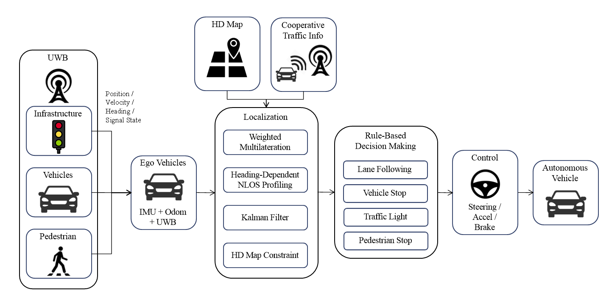

# UWB Autonomous Driving

UWB(Ultra-Wideband) 기반 V2X 측위와 규칙 기반(rule-based) 주행 로직을 CARLA 시뮬레이터 위에 구현한 프로젝트입니다.
카메라/라이다 인지 대신, 차량·보행자·인프라(도로변 앵커, 신호등)에 부착된 UWB 센서 간 거리 측정을 삼변측량(trilateration)하고 IMU/오도메트리와 칼만 필터로 융합해 각 객체의 위치를 추정한 뒤, 이 추정 위치만으로 주행 판단을 수행합니다.

<p align="center">
  
</p>

---

## Overview

- **UWB 위치 추정** — vehicle / pedestrian / infrastructure 3종 에이전트가 서로 UWB 페이로드를 주고받아 자기 위치를 삼변측량하고, 차량은 IMU 헤딩 + 휠 오도메트리 기반 dead-reckoning과 KF로 위치를 보정합니다.
- **NLOS 대응** — 인프라(고정 좌표) 기준 방위각별 레인징 잔차를 온라인으로 학습해, 장애물에 가려 노이즈가 큰 방향의 관측치를 자동으로 덜 신뢰합니다.
- **맵 제약 보정** — CARLA 도로망을 HD맵처럼 활용해, 추정 위치가 주행 가능 차선을 크게 벗어나면(NLOS 드리프트로 판단) 도로 쪽으로 약하게 당기는 pseudo-measurement를 적용합니다.
- **규칙 기반 주행** — Pure-pursuit 조향 + 정지거리/ACC 공식 기반 속도 제어로 신호등·선행 차량·횡단 보행자에 반응해 감속/정지합니다.
- **정량 평가** — CARLA ground-truth와 비교해 "정지가 필요한 이벤트"(정지 차량 대응 / 적색신호 접근 / 보행자 횡단)별 대응 성공률을 자동 집계합니다.

---

## Pipeline

```
1. generate_traffic.py         NPC 차량/보행자 스폰 (선택)
2. sensor_attach.py            차량/보행자에 IMU+UWB 부착, 도로변 앵커 스폰
3. run_agents.py                infrastructure → vehicle → pedestrian 순으로 UWB 에이전트 기동
                                 (각 에이전트가 위치를 추정해 UWB로 송신)
4. rule_based_test.py / hero.py  추정 위치 기반 규칙 기반 주행 (+ 실시간 HUD)
5. scenario_eval.py             CARLA ground-truth 대비 정량 평가
```

---

## Requirements

- Ubuntu 20.04
- CARLA 0.9.16 — `sensor.other.uwb` 커스텀 센서가 포함된 [dh0508/carla_with_UWB](https://github.com/dh0508/carla_with_UWB) 포크가 필요합니다. 공식 CARLA 배포판에는 이 센서가 없어 이 레포의 UWB 위치 추정 코드가 동작하지 않습니다.
- Python 3.8+

```bash
pip install -r requirements.txt
```

---

## Project Structure

```
.
├── docs/
│   └── figures/          # README 등에 쓰이는 이미지 (예: architecture.png)
├── data/
│   ├── map/            # CARLA HD-map 원본(.xodr) 및 학습용 레이어(.json)
│   └── src/             # 맵 로더, 속도 PI 제어기, 좌표 변환 유틸
├── sim_setup/
│   ├── run_setup.py      # 센서 부착 + 에이전트 순차 기동 launcher
│   ├── map_downloader.py # CARLA HD-map 다운로더
│   ├── hero.py            # hero 차량 센서 부착 + 대시보드
│   ├── scenarios/         # 트래픽/신호등/정차 차량 시나리오 생성
│   └── sensor_setting/
│       ├── sensor_attach.py  # IMU/UWB 부착, 도로변 앵커 스폰
│       ├── run_agents.py     # 3종 에이전트 동시 실행
│       └── agent/             # vehicle / pedestrian / infrastructure UWB 에이전트
└── test/
    ├── rule_based_test.py         # 규칙 기반 주행 실행
    ├── scenario_eval.py            # 정지 필요 이벤트 대응 성공률 평가
    ├── run_scenario_eval_seeds.py  # 다중 시드 배치 평가 러너
    ├── carla_hud.py / live_map.py  # 실시간 HUD / macro-map 시각화
    └── carla_common.py             # hero 스폰, route 생성 등 공용 유틸
```

---

## Quick Start

```bash
# 1) CARLA 서버 실행 (별도 터미널)

# 2) (선택) NPC 트래픽 생성
python sim_setup/scenarios/generate_traffic.py -n 30 -w 8

# 3) 센서 부착 + UWB 에이전트 기동
python sim_setup/run_setup.py

# 4) 규칙 기반 주행 실행
python test/rule_based_test.py
```

시나리오 정량 평가:

```bash
python test/run_scenario_eval_seeds.py --runs 30 --duration 600
```

---

## Evaluation

`scenario_eval.py`는 매 tick CARLA ground-truth를 관측해 "정지가 필요한 이벤트"별 대응 성공률을 아래와 같은 표로 집계합니다.

| 이벤트 | 설명 |
|---|---|
| 정지 차량 대응 | 선행 정지 차량에 대한 감속/정지 |
| 적색신호 접근 | 적색/황색 신호에 대한 정지 |
| 보행자 횡단 | 횡단 보행자에 대한 정지/안전 통과 |

